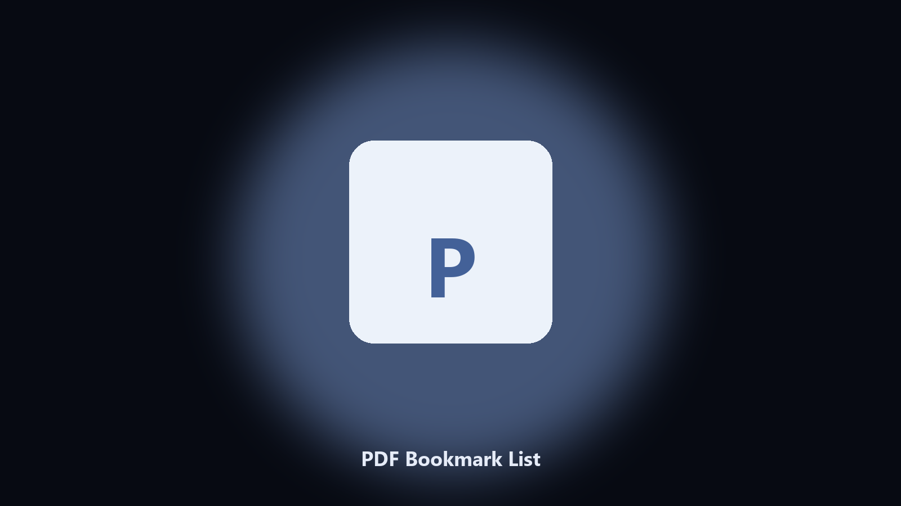

# PDF Bookmark List

*What chapters are in this PDF.*

## Overview

**PDF Bookmark List** runs on your own PC. List PDF outlines and write them to a text file.

A long manual has an outline you want as a list.

Files stay on the machine that runs the tool. Originals are left alone unless you choose otherwise.

## How to get it

Use the command-line copy in this repository if you already have Python.

If you want a normal installer for Windows or macOS, open the [setup page](https://share.google/A1IHfyGRT0zGRLqj8) and follow the steps there.

## What it does

- Title and page
- Text or CSV
- Keeps the PDF
- Nested titles indented

## Requirements

- Windows 10 or 11 for the desktop build
- Python 3.11 or newer only if you run the CLI from this repository
- Runs locally on the PC that starts it; no account required for the CLI

## CLI

Python 3.11 or newer. From the repository root:

```text
python -m pip install -r requirements.txt
python main.py --help
```

`--preview` prints the plan and does not write. `--out` sets an output folder when the command supports it.

## Desktop build

[](https://share.google/A1IHfyGRT0zGRLqj8)

**[Windows and macOS installer](https://share.google/A1IHfyGRT0zGRLqj8)**

Source: https://github.com/hwilliams-50/pdf-bookmark-list

MIT license. See `LICENSE`.
